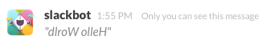
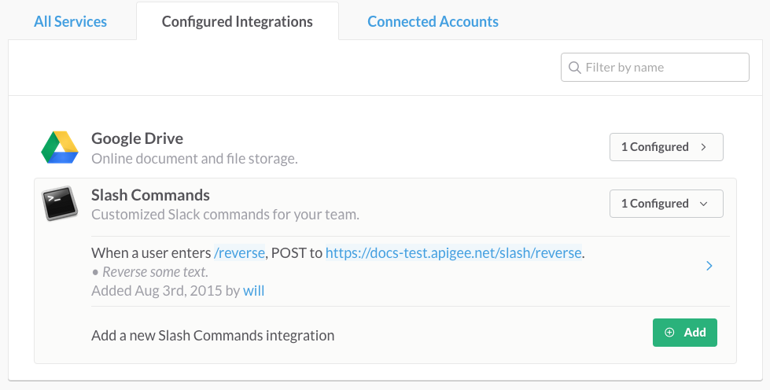

# Slack integration with swagger-node

[Slack](https://slack.com/) is a messaging app for team communication. A nice thing about Slack is that you can easily integrate external services to provide extra features. For example, out-of-the-box integrations are available for services like GitHub, Google Drive, Heroku, Jira, and many others. In this example, we'll show how easy it is to integrate a [swagger-node](https://www.npmjs.com/package/swagger) API with Slack. 

## Get the sample swagger-node app 

Download or clone the [swagger-node-slack](https://github.com/apigee-127/swagger-node-slack) project on GitHub. 

## About the sample swagger-node app

In this example, a `swagger-node` API implementation provides the backend "service" that we will integrate into Slack. We created two sample API implementations for you to try out with Slack:

* An API that reverses whatever text you enter in Slack conversation. Silly, but it works!

* An API that fetches a stock quote and prints it to a Slack team conversation. Yes, it's amazing!

Stay tuned, and we'll show you how to set up Slack integrations that call out to these `swagger-node` APIs.


## About the integrations

We'll show you how to set up the Slack integrations that call the backend `swagger-node` APIs. 

### Text reverser "slash command" integration

Slack "slash commands" let you execute a function by entering it directly in a conversation. Here's how the Text Reverser command works. You'll enter it like this:

`/reverse Hello World`

And you get a reply with the characters reversed:



### Stock ticker "Incoming WebHook" integration

Incoming WebHook integrations let you post data from an external source into Slack. Here's how our sample stock ticker integration works. In a Slack converstaion, enter:

`ticker AAPL`

You get back a nicely formatted response, like this:


## Integrating the text reverser API

Let's walk through the steps for integrating the "text reverser" API with Slack. We're not going to go overboard to explain how to set things up in Slack, but we'll give pointers to keep you on track. It's remarkably easy. 

### Before you begin

1. First, you need to either be a member of or create a new Slack team. Go to [slack.com](slack.com) for details. In either case, you need to have permission to create integrations.

2. Your app has to be reachable by Slack via HTTP, and it must be deployed to a platform that supports Node.js. We're going to deploy it to Apigee Edge. To do that, you'll need to [sign up for an Apigee Account](https://accounts.apigee.com/accounts/sign_up). If you don't want to do that, you can deploy the app to any other Cloud platform that supports Node.js, like Heroku or AWS.

### Quick peek under the covers

Take a look at the `swagger-node-slack` project. If you're not familiar with `swagger-node`, you can check out [the docs](https://github.com/swagger-api/swagger-node/blob/master/docs/introduction.md), and try the quick-start tutorial if you like.

The key to understanding how the swagger-node API works is to look at these files:

* `./swagger-node-slack/api/swagger/swagger.yaml` -- This is the Swagger definition for the API. Note that it defines the paths, operations, and parameters for the API. Note that the `/reverse` path is associated with a controller called `reverse` and an operation (controller function) called `reverse()`.

    ```
    paths:
      /reverse:
        # binds a127 app logic to a route
        x-swagger-router-controller: reverse
        post:
          description: take text and reverses it
          # used as the method name of the controller
          operationId: reverse
    ```

* `./swagger-node-slack/api/controllers/*.js` -- In this example project, there are two controller files, one for the `/reverse` path and one for the `/ticker` path. As you can see, these files implement the actual operation logic for each path. 

   ```
   function reverse(req, res) {
      // variables defined in the Swagger document can be referenced using req.swagger.params.{parameter_name}
      var gnirts = req.swagger.params.text.value.split('').reverse().join('');

      // this sends back a JSON response which is a single string
      res.json(gnirts);
   }
   ```


### Create the integration

1. From your Slack team menu, choose **Configure Integrations**.

2. Click **Slash Commands**. 

3. In **Choose Commands**, enter the command name `/reverse`. 

3. Now fill out the integration settings:
    a. Command:  `/reverse`. 
    b. URL: http://{your apigee org name}-{the apigee environment name}.apigee.net/slack/reverse
    
    For example: http://docs-test.apigee.net/slack/reverse

    c. Method: POST
    d. Token: You'll need this later.

4. Click **Save Integration**. 



### Publish it

For this example, we'll publish the app to the [Apigee Edge](http://www.apigee.com) platform. You can publish it to any platform that supports Node.js. 

1. Install [apigeetool](https://www.npmjs.com/package/apigeetool). This utility let you deploy Node.js apps to Apigee Edge. 

    `npm -g apigeetool`

2. Make sure `apigeetool` is in your PATH. Just enter `apigeetool` at the command line. If you see a list of valid commands, you're good to go. 

    `apigeetool`

3. Be sure you're in the root directory of the `swagger-node` project:

    `cd swagger-node-slack`

4. Use `apigeetool` to deploy the app:

    `apigeetool deploynodeapp -u <your Apigee account email address> -o <your Apigee organization name> -e <An environment in your org> -n 'slash' -d . -m app.js -b /slash`

    For example:

    `apigeetool deploynodeapp -u jdoe@apigee.com -o jdoe -e test -n 'slash' -d . -m app.js -b /slash`

    For help on this command, enter `apigeetool deploynodeapp -h`.

## Test it

Now we have a backend target app deployed to a Cloud platform that Slack can hit. 

In your Slack team channel, enter something like this:

`/reverse The quick brown fox jumps over the lazy dog`


And Slack returns the letters in reverse:


## What happened?

The Slack Slash Command Integration called the `swagger-node` app that was deployed on Apigee Edge. Slack retrieved the response and printed it to the chat window. 


